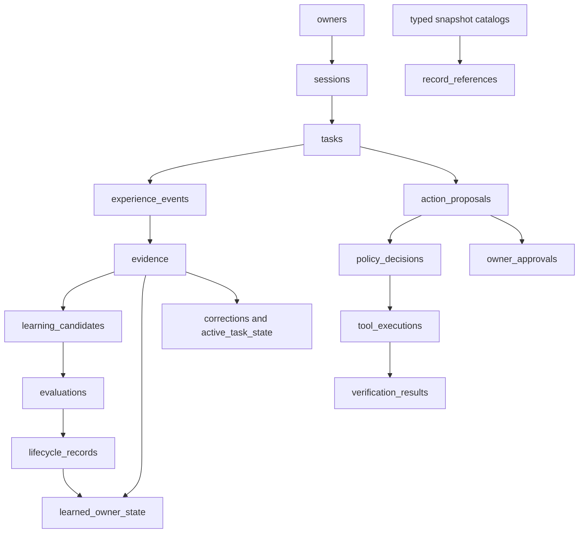

# @aven/storage

AVEN-003 supplies local SQLite structure, integrity constraints, deterministic
migrations, and AVEN-002 serialization. It supplies no Experience Ledger service
or domain append/write API. `packages/ledger` remains a placeholder.

## Structural proposal and stack

The small structural proposal was reported before implementation: a storage
workspace owns database concerns shared by future Ledger, owner-state,
evaluation, and authority components. It does not move their logical
responsibilities into a new service. No architecture change is required.

Stable dependencies were verified against official npm metadata on October
4, 2026. Node 24.19.0 / pnpm 11.19.0 are the existing toolchain.

| Dependency                    | Reason                                                                                                                                                        |
| ----------------------------- | ------------------------------------------------------------------------------------------------------------------------------------------------------------- |
| `drizzle-orm` 0.45.3          | Typed SQLite query mappings and contract-aware column serialization.                                                                                          |
| `better-sqlite3` 13.0.3       | Local SQLite driver supported by stable Drizzle; requires Node >=22. Its packaged Windows native binary works with the current Node 24 without build scripts. |
| `@types/better-sqlite3` 9.6.0 | Driver types for strict TypeScript.                                                                                                                           |
| `@aven/contracts` workspace   | The existing domain schemas; no second SQL domain model.                                                                                                      |
| `zod` 4.6.5                   | Existing pinned version; inferred serialization types.                                                                                                        |
| TypeScript / Vitest           | Existing pinned development versions, reused for package checks.                                                                                              |

The only new transitive package is `node-addon-api` 8.9.2, required by the
driver. Existing resolutions remain unchanged. No Drizzle Kit is needed: SQL is
the DDL authority. No PostgreSQL, Redis, Docker, vectors, or cloud services.

Sources:
[Drizzle SQLite integration](https://orm.drizzle.team/docs/sqlite/get-started-sqlite),
[Drizzle Node SQLite guide](https://orm.drizzle.team/docs/sqlite/connect-node-sqlite),
[driver package metadata](https://registry.npmjs.org/better-sqlite3/13.0.3), and
[Drizzle package metadata](https://registry.npmjs.org/drizzle-orm/0.45.3). The
Node SQLite guide requires `drizzle-orm@rc`; using that adapter would depart
from the stable dependency requirement. The chosen driver integrates without a
custom adapter or prerelease.

## Table inventory

All durable domain rows carry a physically stored, non-null `owner_id`. Contract
snapshots expose generated `record_id`, `record_version`, `schema_version`, and
`created_at`. Generated fields cannot diverge from the serialized contract.
Names such as event ID and learned-item ID map to the appropriate table's
`record_id`.

| Table                  | Purpose and important columns                                                                                                                                        |
| ---------------------- | -------------------------------------------------------------------------------------------------------------------------------------------------------------------- |
| `owners`               | Explicit owner ID and creation time; no inferred owner attributes.                                                                                                   |
| `sessions`             | Owner-bound session ID and creation time.                                                                                                                            |
| `tasks`                | Owner-bound task ID, exact session, creation time.                                                                                                                   |
| `experience_events`    | Immutable event ID, local sequence, type, occurrence/recording times, optional task/session, schema version, source kind/trust, complete event payload.              |
| `evidence`             | Immutable evidence ID, exact source event, source kind and declared trust.                                                                                           |
| `learned_owner_state`  | Versioned durable fact/preference/episode/intent-pattern/procedure snapshots; scope, lifecycle, validation time, candidate/promotion and replacement/fallback links. |
| `active_task_state`    | Separate task-bound active/closed snapshots, objective and open loops. This is not a durable lesson.                                                                 |
| `learning_candidates`  | Separate versioned proposed content/scope, candidate lifecycle, support and source-independence assessment.                                                          |
| `no_useful_lessons`    | A learning outcome with considered evidence and generation metadata, without a candidate or learned state.                                                           |
| `corrections`          | Category, original behavior, corrected instruction, target, immediate applicability and durable scope hint.                                                          |
| `action_proposals`     | Versioned proposals, parameter digest, caller-declared full-proposal digest and exact task/session.                                                                  |
| `policy_decisions`     | Separate immutable decision identity, outcome, basis, exact proposal/version/digests.                                                                                |
| `owner_approvals`      | Versioned approval snapshots, exact proposal/version/digests and bounds, issuance, expiry, revocation event/time.                                                    |
| `tool_executions`      | Immutable execution identity, attempted flag, reported outcome, exact policy outcome and proposal binding.                                                           |
| `verification_results` | Immutable verification identity, execution reference, method, evidence and separate verdict.                                                                         |
| `evaluations`          | Versioned results; embedded definition ID/version/scope, split, oracle, actual observation, scorer, verdict and subject links.                                       |
| `lifecycle_records`    | Promotion/rejection/supersession/revocation/rollback snapshots keyed by their recording event; exact authority and state/candidate/evaluation links.                 |
| `record_keys`          | Metadata-only owner/kind/ID catalog for unversioned contract references.                                                                                             |
| `record_versions`      | Metadata-only catalog of exact owner/kind/ID/version tuples.                                                                                                         |
| `record_references`    | Normalized path-labelled evidence, derivation, root-source, counterexample, state, event, candidate, evaluation, task/session, approval and authority edges.         |
| `schema_migrations`    | Database-wide migration version, filename, SQL SHA-256 and application time; no owner data.                                                                          |

These are 21 application tables. SQLite additionally manages `sqlite_sequence`.
The three identity tables have no invented session/task runtime lifecycles.
`record_snapshots` is a union view used to validate the metadata catalogs; it
stores no data and is not a generic memory table or a Context Broker.

The four `latest_*` views for durable state, task state, candidates and
approvals return the greatest recorded version per owner/ID, including inactive
statuses. They expose **latest declared snapshots**, not authenticated
Root-selected versions. Consumers must not query historical `status = 'trusted'`
rows as if they were currently applicable. No convenience view mixes candidates
into owner state.

## Relationships and integrity



Arrows show stored relationships, not execution or automatic state transitions.
All snapshot families register immutable metadata catalog entries. References
have a foreign key to their source version and to the target identity, plus an
exact target-version FK wherever AVEN-002 supplies a version. The catalogs have
no JSON and cannot contain phantom entries: insertion requires a real typed
snapshot. Edge insertion must match the source snapshot's v1 reference
projection. Projection triggers fill edges automatically, so an array in JSON
cannot silently omit its relational counterpart.

`references.ts` visits validated contract objects and recognized reference keys;
it does not scan prose for IDs. Paths retain roles, including
`$.evidence.sourceIndependence.rootSources[0]`, derivations, counterexamples,
assessment evidence and oracle evidence. Evidence links bind both evidence ID
and its event ID. Event `evidenceIds` denotes evidence recorded by that event;
citations to other events use AVEN-002 evidence references. Declaration of
source independence is retained without automatically calculating corroboration.

The shared `owner_state` catalog alias permits correction targets to reference
either durable or active task state and prevents duplicate learned-item
ID/version tuples across those tables. Durable lineage references still target
the durable table specifically. References to approvals, policy decisions and
executions follow the unversioned references in AVEN-002. Policies/executions/
verifications use one immutable identity; approval identities can have multiple
immutable lifecycle snapshots. An approval ID reference does not select an
authenticated usable revision.

Composite FKs enforce owner consistency, task/session agreement, proposal
version and both digest values, approval bounds, and execution/transition
decision outcome plus its complete binding. The same authority checks apply to
nested references in raw event payloads. Known promotion/rejection/supersession/
revocation/rollback pointers require the appropriate learning event type.
Approval-revocation pointers remain generic event references because AVEN-002
does not define a distinct approval-revoked event type.

Constraints do not require execution after ALLOW, verification after reported
success, or successful verification. Execution after DENY remains representable
for auditing unauthorized attempts. Nothing inferred about intent can create an
approval. Snapshot parsing does not prove any issuer authentic.

IDs are unique in an owner-and-record-kind namespace; revisions additionally use
positive safe-integer versions. ID prefixes still come from AVEN-002.
Corrections have no separate contract ID, so storage uses their source evidence
ID plus record version. Lifecycle records use event ID. `no_useful_lessons` has
no contract ID, so `storage_id` is an explicit local storage key outside the
serialized contract. No domain ID or event type was added to AVEN-002.

## JSON policy and validation

The **only JSON column** is `record_json` in each of the fourteen snapshot
families below. Every value passes its existing AVEN-002 Zod schema on
serialization and deserialization. SQLite also invokes the same schema in a
`CHECK` through the registered `aven_valid_v1` function. Direct SQL through a
configured connection therefore cannot bypass required scope, lifecycle,
positive versions or discriminated authority shapes. `STRICT` tables, non-null
generated columns and relational constraints supplement validation.

| Table's `record_json`  | Why retain the structured payload                                                                                                                          |
| ---------------------- | ---------------------------------------------------------------------------------------------------------------------------------------------------------- |
| `experience_events`    | Lossless typed historical envelope and payload, including model/runtime creation stamps; avoid reconstructing historical meaning from mutable projections. |
| `evidence`             | Recorded text or immutable artifact locator, complete provenance/model metadata.                                                                           |
| `learned_owner_state`  | Category-specific content, declarative procedure steps, scope qualifiers, evidence assessments and lifecycle details.                                      |
| `active_task_state`    | Task objective/open-loop list and closure details; no invented global scope.                                                                               |
| `learning_candidates`  | Proposed content/scope, generation model, support/counterexamples, evaluations and lifecycle claim.                                                        |
| `no_useful_lessons`    | Reason, considered evidence and generation details without manufacturing a learned item.                                                                   |
| `corrections`          | Original behavior, corrected text, target description, immediate applicability and durable scope hint.                                                     |
| `action_proposals`     | Tool/action, resource/consequences, requested authority and immutable parameter locator; not an arbitrary parameter blob.                                  |
| `policy_decisions`     | Policy issuer/version/digest, reason codes, grant reference or approval basis.                                                                             |
| `owner_approvals`      | Owner provenance/evidence, temporal bounds and revocation explanation.                                                                                     |
| `tool_executions`      | Completed report, failure/retry information, returned artifact or uncertainty.                                                                             |
| `verification_results` | Observable evidence/check specification and method details; model-only outcomes remain inconclusive.                                                       |
| `evaluations`          | Complete per-result definition/oracle snapshot, expected/actual outcomes, subject/evaluator models, scorer and independence assessment.                    |
| `lifecycle_records`    | Transition reason/time and all declared lineage/evaluation/authority relationships.                                                                        |

IDs, versions, owner, event type, category, lifecycle, scope kind, authority
bindings and important lineage edges are queryable and enforced relationally. No
caller must maintain duplicate JSON and ordinary-column copies. An absent
`declared_trust` means the provenance contract makes no such trust assertion; it
does not imply trusted. `trusted` is a learned-state lifecycle declaration, not
a truth label for evidence.

Unknown, uncertain, bounded and explicit global scope retain their full AVEN-002
representation. Global requires the explicit declaration; missing/null scope is
rejected. Qualifier/temporal prose is not further decomposed because there is no
v0.1 ontology or semantic matching guarantee. Exact task IDs inside even
uncertain scope alternatives still get owner-bound FKs. AVEN-002 couples task
and session bounds; absent event bounds are null together. A new session-only
event shape is not invented here.

Evaluation definitions remain embedded per-result snapshots, as AVEN-002
specifies. Equal definition IDs in different results are not an enforced global
definition registry. Oracle kind and scorer kind remain separate query columns;
a model oracle is advisory and an unresolved oracle forces INDETERMINATE.
Artifact locators/digests are declared values, not resolved external files.

## Event ordering and immutable snapshots

`experience_events.sequence` is SQLite `INTEGER PRIMARY KEY AUTOINCREMENT`,
bounded to JavaScript's safe-integer range. With ordinary inserts, SQLite
allocates increasing values within this database. Replay uses
`WHERE owner_id = ? ORDER BY sequence ASC`; stable event IDs remain identity.
Sequence is global to this database, so an owner's sequence can contain gaps. It
is not timestamp order, occurrence order, a per-owner contiguous counter, or
distributed causal order. SQLite serializes writers; order within a transaction
is insertion order. Failed/rolled-back values may be reused because they were
never committed history. Explicit sequence values must advance the existing
high-water mark and can create gaps; they are not an import/replay API.

All historical events/evidence and all other domain **snapshots** reject UPDATE,
DELETE, replacement, and UPSERT-overwrite with SQL triggers. Derived state and
candidate revisions insert a new positive version. This implements immutable
storage integrity in AVEN-003 because it is a schema property; it does not
implement the AVEN-004 Ledger writer, transaction assembly, capture
completeness, replay/rebuild, crash recovery, or tamper-resistant audit service.

State/candidate/evaluation/event relationships can be cyclic. FKs for snapshot
references are `DEFERRABLE INITIALLY DEFERRED`, enabling an explicitly assembled
transaction to insert all endpoints in either order. A dangling reference fails
at COMMIT; the caller must roll back a failed transaction. There is no
production transaction-assembly function in this package. Tests use test-only
helpers.

## Connection and migration workflow

```sh
pnpm install --frozen-lockfile --ignore-scripts
pnpm db:test
pnpm db:migrate
pnpm check
```

`db:migrate` defaults to repository `data/aven.sqlite`. The directory, database
files, rollback journals and WAL/SHM sidecars are ignored. A custom path can be
passed to `pnpm --filter @aven/storage migrate <absolute-path>`. No real owner
data belongs in tests; all persistence fixtures are synthetic and temporary.

```ts
import { openStorage, migrate } from '@aven/storage';

const storage = openStorage('/absolute/local/path/aven.sqlite');
try {
  migrate(storage.sqlite);
  // Connection and typed schema are available for future components.
} finally {
  storage.close();
}
```

Opening explicitly enables and checks SQLite foreign keys, enables recursive
triggers, registers v1 Zod/reference functions, and sets a 5-second busy
timeout. It does not migrate automatically or set an owner. SQLite's default
local journal mode is retained; no concurrency/performance claim is made.

The authoritative migration is `migrations/0001_storage.sql`. The runner reads
contiguously numbered SQL files, takes `BEGIN IMMEDIATE`, checks existing
filename/version/SHA-256 history and `PRAGMA user_version`, applies pending SQL,
checks foreign keys, then commits. Failure rolls back both schema and history.
Re-running an unchanged migration is a no-op. Unknown, gapped or altered history
is rejected. SQL files already applied must not be edited; append a migration.
There is no schema-push command or automatic SQL generation from Drizzle.

`schema.ts` is a query mapping, not a parallel DDL specification. Its contract
column adapters parse in both directions; generated columns are excluded from
ordinary inserts. A test checks mapped columns against migrated SQLite.
`record_references` has additional generated FK routing columns not needed in
the typed query mapping. Metadata catalogs and diagnostic views can be inspected
with SQL.

The SQLite functions are part of the v1 migration compatibility contract. Keep
the v1 AVEN-002 schemas and `referencesV1` semantics available when future
versions arrive. Changing those functions can change validation/projection
meaning even without changing SQL; SQL hashes alone do not guard that code.
Future versions need explicit validators/projections and reviewed migrations.
External SQLite clients can read the stored columns, but ordinary writes fail
without these registered functions. Use the configured connection for migrations
and writes. This deliberate coupling avoids a second independent validation
model in SQL; it is not a language-neutral standalone SQL writer interface.

Root and storage test commands use Vitest's supported native config loader with
the existing Node 24 TypeScript support. This avoids esbuild's config bundler
trying to inspect parent directories outside a restricted workspace. It changes
neither test selection nor the contract sources. The unchanged contracts package
command can also accept `--configLoader native` in such an environment.

Sources: SQLite documents
[generated columns and their FK/index support](https://sqlite.org/gencol.html),
[foreign-key enforcement and deferred constraints](https://sqlite.org/foreignkeys.html),
and [local AUTOINCREMENT semantics](https://sqlite.org/autoinc.html).

## Deletion, trust and limits

Every FK uses **ON DELETE RESTRICT / ON UPDATE RESTRICT**. No canonical evidence
cascade and no lineage-erasing SET NULL exist. Optional absent relations mean
the contract omitted a relation, not that deletion erased it. Unreferenced empty
identity rows can be deleted; recorded snapshots and their edges cannot.

Append-only auditability conflicts with future owner deletion/erasure. AVEN-003
chooses evidence preservation for this milestone, not a permanent erasure
policy. Retention, redaction/tombstones, backups, exports and cryptographic
erasure require a later explicit design. This package implements no erasure.

The tested guarantees require an intact schema and the configured connection.
SQLite is not a multi-tenant authorization system. Anyone able to open the file,
alter schema/functions, disable checks/foreign keys, or replace the file can
bypass these protections. No OS isolation, encryption, access control or
authenticated identity is supplied. Owner-bound FKs prevent accidental
cross-owner references; they do not authenticate who is reading or writing.

Provenance and all oracle/trust/independence labels remain declared claims.
There is no truth validation, source authentication, recursive taint
propagation, indirect lineage-cycle detection, or proof that two roots are
independent. Full-proposal digests are caller-supplied SHA-256 claims; FKs
compare exact values but do not select a canonical hashing algorithm or verify
artifacts. No runtime checks establish current approval validity, expiry/replay
protection, policy grant validity, or consistency of an approval basis with a
currently usable approval revision. Those remain Root responsibilities.
Reference existence/event type is not evidence that a promotion is authorized or
that its state/candidate/evaluation claims justify promotion.

No automatic state transitions or complete semantic agreement between every
event payload and every separately stored snapshot are asserted. In particular,
later code must assemble complete recording transactions and resolve reciprocal
promotion/rollback relationships, current trusted-version selection, evaluator
independence, and held-out restrictions. Recording immutable snapshots does not
establish that they are rebuildable from an adequately captured event stream.

AVEN-003 does **not** provide an Experience Ledger service, authenticated owner
identity, Root security, semantic scope inference, truth validation, learning,
policy enforcement, tool execution, execution verification, or erasure
implementation. It also does not provide Context Broker retrieval, model
providers, APIs/UI, a promotion controller, runtime orchestration, or
experimental results. Stop here; AVEN-004 is a separate authorization.
